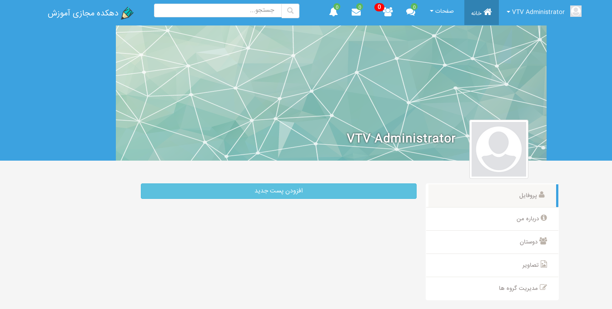
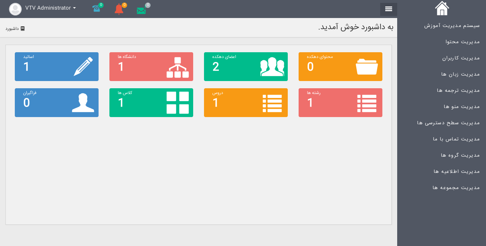
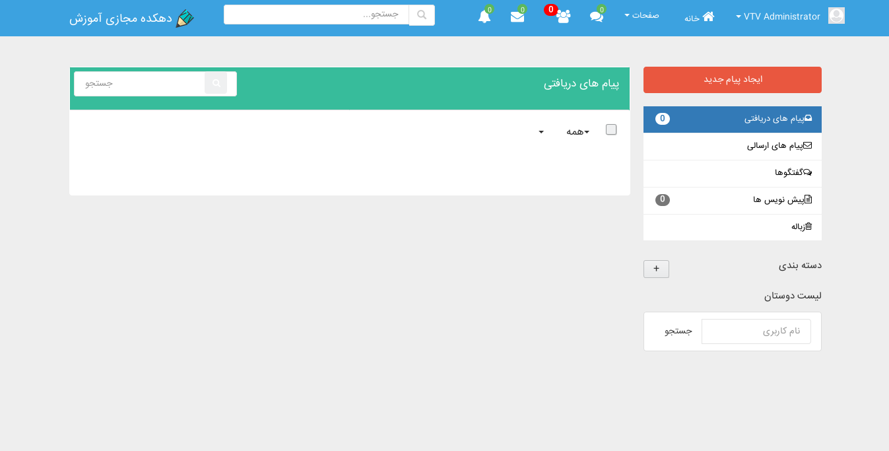

# resume
My resume

# Virtual Training Village
A social network based on educational system.
Educational institutions can register and manage their courses and tests online.
Users can attend these courses and receive a certificate of the course.
On the other hand, users can share contents with other friends and have interaction with their friends.

